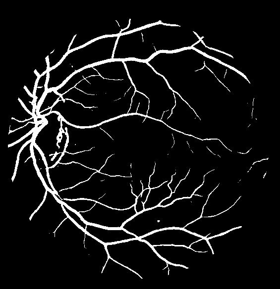

# NTU IE4476 Image Processing Project - Automatic retinal segmentation system

Two automatic retinal segmentation systems based on adaptive filtering and based on UNet.

## Sample results
| Ground Truth             |  Segmented by Thresholding | Segmented by UNet
:-------------------------:|:-------------------------: |:-------------------------:
  |   | 
